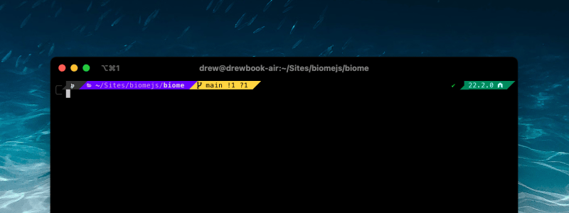

# 🌊 Pipeline for macOS



Rad setup scripts to get your Mac [_pitted_](https://youtu.be/Y5ckCAUVOn0?si=puIdT-Yu3xuY1mZK) for development. Installs the bare-minimum most dev setups need:

## 🏄 Features

| Name                                                            | What is it?                                                                        |
| :-------------------------------------------------------------- | :--------------------------------------------------------------------------------- |
| Xcode Tools                                                     | You need this for almost any development anyway.                                   |
| [Homebrew](https://brew.sh/)                                    | The unofficial package manager for Mac.                                            |
| [Git](https://git-scm.com/)                                     | Standard version control for modern software.                                      |
| [fnm](https://github.com/Schniz/fnm)                            | Lightweight [Node] version manager, powered by Rust.                               |
| [pnpm](https://pnpm.io)                                         | Better npm.                                                                        |
| [Oh My Zsh](https://github.com/robbyrussell/oh-my-zsh)          | Terminal themes & handy plugins for people that don’t enjoy writing shell scripts. |
| [powerlevel10k theme](https://github.com/romkatv/powerlevel10k) | Flexible, customizable, do-it-all theme for Zshell.                                |

No cruft, unopinionated, all easily-reversible.

## 🚀 Quickstart

> ![TIP] > [iTerm2](https://iterm2.com/) or [Warp](https://www.warp.dev/) is **strongly recommended** for Terminal. It has better color support and more modern features than the default Terminal application.

Run the folowing command in a terminal ([view source][source])

```sh
sudo sh -c "$(curl -s https://raw.githubusercontent.com/drwpow/pipeline/main/bin/pipeline)"
```

At the end, you’ll enter the [powerlevel10k](https://github.com/romkatv/powerlevel10k) config. It’s recommended to **Install the Meslo Nerd Font** as part of the setup so the theme displays properly.

_Note: This script is safe to re-run as many times as you’d like! `sudo` is only required for installing [Homebrew](https://brew.sh/) and can be skipped if you’ve installed that already._

### ↪️ Next Steps

- [Configure iTerm manually](https://iterm2.com/documentation-preferences.html) also according to your liking
- Dive into [powerlevel10k’s advanced config](https://github.com/romkatv/powerlevel10k?tab=readme-ov-file#configuration) for finetuning your theme.
- If you need [Git LFS](https://github.com/git-lfs/git-lfs) you’ll need to install it manually.

## 🗑️ Uninstalling

There’s not an uninstall script, but the changes this script makes are fully reversible:

| Change                   | Uninstalling                                                                                                                                            |
| :----------------------- | :------------------------------------------------------------------------------------------------------------------------------------------------------ |
| fnm, Git                 | `brew uninstall fnm git`                                                                                                                                |
| Homebrew                 | [Uninstall](https://docs.brew.sh/FAQ#how-do-i-uninstall-homebrew)                                                                                       |
| Oh My Zsh                | [Uninstall](https://github.com/ohmyzsh/ohmyzsh/wiki/FAQ#how-do-i-uninstall-oh-my-zsh) (note that this will also remove plugins & theme changes as well) |
| `~/.hushlogin`           | This hides the annoying ”Last login” message on every terminal bootup. Delete this empty file to undo it.                                               |
| `~/.zshrc.pre-oh-my-zsh` | Oh My Zsh will leave this around, in case you want to switch back to your preexisting setup.                                                            |

That’s it! No other files or system settings were affected.

## ️🤷🏻‍♂️ About

This setup script came about from several people over the years asking me [about my config][config], and to set up their machines. I had more than 2 people ask, so I automated it 🤖.

I also don’t like a ton of tools. So this doesn’t add any cruft; only the tried-and-true tools I’ve used for years.

This software is **public domain**. Remix, copy, steal, whatever—just use it to help others! Use at your own risk.

### Inspiration

- [Laptop](https://github.com/thoughtbot/laptop) by thoughtbot
- [Formation](https://github.com/minamarkham/formation) by Mina Markham
