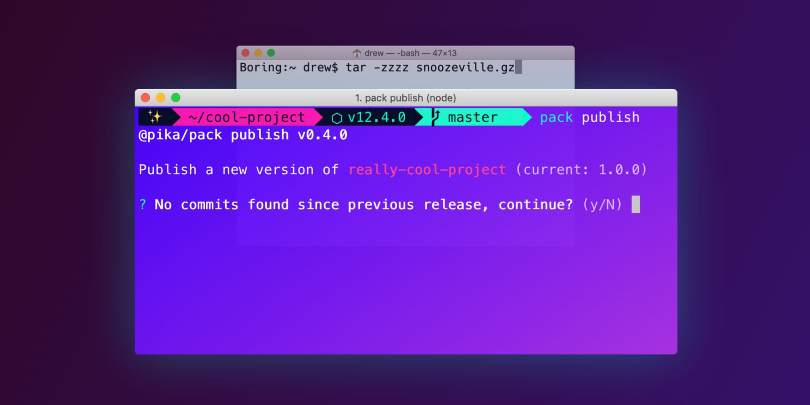

# 🌊 Pipeline for Mac



Rad setup scripts to prepare your Mac for development. Installs
[Homebrew][homebrew], [Git][git], [Oh My Zsh][oh-my-zsh], [nodenv][nodenv],
and a 💅 stylin [terminal theme][zsh-bullet-train]. Installs the bare-minimum
to get you up-and running without slowing you down. Afterwards you can
customize anything added (see FAQ below), or install any additional packages
you need.

## 🏄 Features

| Name                   | What is it?                                                                                                                                                                                                               |
| :--------------------- | :------------------------------------------------------------------------------------------------------------------------------------------------------------------------------------------------------------------------ |
| Xcode Tools            | Utilities needed for most programs, without the weight of full [Xcode][xcode]. This tiny install is needed for most other dev tools on Mac.                                                                               |
| [Homebrew][homebrew]   | THE package manager for Mac. Lets you install & uninstall software quickly, painlessly, and without putting your system in danger.                                                                                        |
| [Git][git]             | Standard version control for modern software. Enables teams to work collaboratively and keep backups of all historic code changes.                                                                                        |
| [Nodenv][nodenv]       | Multiple projects require different [Node.js][node] versions. Nodenv lets you effortlessly switch between Node.js versions, or fall back to your preferred default version if none is specified. Simpler to use than NVM. |
| [Oh My Zsh][oh-my-zsh] | Get an awesome shell without copying + pasting shell scripts willy-nilly. Plugins, themes, and a community make shell customization fun!                                                                                  |
| [ripgrep][ripgrep]     | Search contents of all files on your system faster than… well… just about anything else.                                                                                                                                  |

_[Golang][golang], [PHPBrew][phpbrew], [Postgres][postgres], and
[rbenv][rbenv] are **not** installed by this script. These, along with
anything else you need, can be installed via Homebrew or otherwise after
installation._

## 🚀 Running the script

It’s important to view the [source][source] before installing any script.

Once you’re ready, run the following command from any terminal:

```bash
sh -c "$(curl -s https://raw.githubusercontent.com/dangodev/pipeline/master/bin/pipeline)"
```

## 💅 Customizing

The following steps can‘t be set from the shell command. But they’re also
based on your personal preference anyway, so here’s where you get to customize!

- [ ] Change the font in your terminal to the newly-installed “Perplexed” font in
      order for the icons to work correctly. Many terminals don’t allow changing
      this via the shell, so this is a manual change.
- [ ] Grab an ✨ awesome terminal background from
      [here][awesome-terminal-backgrounds].
- [ ] In your terminal, change your ANSI colors to match your new theme better

## 🤓 Commands

Okay, it’s installed… now what can I do?

| Command                         | What it does                                                                                                                     |
| :------------------------------ | :------------------------------------------------------------------------------------------------------------------------------- |
| (start typing)                  | Your shell will now highlight correct commands in **green**, incorrect ones in **red**—before you hit <kbd>Enter</kbd>!          |
| (start typing) + <kbd>tab</kbd> | Start typing any command, and hit <kbd>tab</kbd>. Your shell will try and complete it for you!                                   |
| `z [my-folder]`                 | Jump quickly from any folder to another, by typing its name (_note: `cd` into it first_)                                         |
| `rg myFunction ~/code`          | Search all files in `~/code` containing `myFunction` using [ripgrep][ripgrep]. Blazing-fast 🔥                                   |
| `gl`                            | `git pull --rebase` Update branch with origin                                                                                    |
| `gpf`                           | `git push --force --force-with-lease` Force-push but fail if something changed remotely (great for ninja edits without the risk) |
| `grc`                           | `git rebase --continue` If rebasing through a conflict, continue                                                                 |
| `grm`                           | `git rebase -i origin/master` Rebase current branch from master                                                                  |

### Tips

- **Manage Node with ease.** Add a `.node-version` file in any folder with
  `12.4.0` (or any node version). Now whenever you’re in that folder,
  [nodenv][nodenv] will automatically switch the Node version for you 🎉 (if
  you’re missing that version, just run `nodenv install [version]`).
- **Ditch editor projects.** If you use VS Code, install the `code` command
  (<kbd>⌘</kbd> + <kbd>Shift</kbd> + <kbd>P</kbd>, type `code`). Now you can
  jump between projects with `z project1 && code .` and `z project2 && code .`

## 💁 FAQ

### I don’t have a cool gradient background! How do I get one?

Alas, terminal backgrounds (along with fonts) are something this script
cannot do. But good news! You can find many great backgrounds at [✨
awesome-terminal-backgrounds][awesome-terminal-backgrounds].

### How can I change the terminal segments / what if I want something else instead of Node version?

[Bullet Train][bullet-train], was built for customization (and why I prefer
it over the similar-looking Agnoster theme for zsh). In your `.zshrc` file,
you’ll see the following lines:

```
prompt_emoji() {
  prompt_segment black white "✨"
}
BULLETTRAIN_PROMPT_ORDER=(emoji status dir nvm git)
BULLETTRAIN_PROMPT_ADD_NEWLINE=false
BULLETTRAIN_PROMPT_CHAR=""
BULLETTRAIN_DIR_BG=magenta
BULLETTRAIN_DIR_FG=black
BULLETTRAIN_GIT_BG=green
BULLETTRAIN_GIT_COLORIZE_DIRTY=true
BULLETTRAIN_GIT_EXTENDED=false
BULLETTRAIN_GIT_FG=black
BULLETTRAIN_NVM_BG=black
BULLETTRAIN_NVM_FG=green
BULLETTRAIN_NVM_SHOW=true
```

Edit `BULLETTRAIN_PROMPT_ORDER` to change the terminal prompt. You can swap
any out for for Ruby, Kubernetes, Go, and more! You can also adjust the
foreground & background colors for each segment. [Read more][bullet-train]

### What other themes are there?

Oh My Zsh has [quite a few built-in themes][oh-my-zsh-theme], as well as a
wide selection of [third-party ones][oh-my-zsh-external]. Give ’em all a spin!

### I’m seeing weird symbols in my terminal. Is that normal?

You probably need to change your font to “Perplexed,” a patched version of
IBM Sans with built-in icons for your terminal.

### I don’t like the terminal font. Can I change it?

You can install any font with modified special characters (needed for the
icons in terminal). You can find such fonts here:

- [Nerd Fonts][nerd-fonts]
- [Powerline Fonts][powerline-fonts]

## 🗑️ Uninstalling

There’s not an uninstall script, but the changes this script makes are easy
to undo:

| Change                           | Uninstalling                                                                                                                                                                                                                                    |
| :------------------------------- | :---------------------------------------------------------------------------------------------------------------------------------------------------------------------------------------------------------------------------------------------- |
| Xcode tools                      | [Uninstall][xcode-uninstall] but I wouldn’t recommend it as this should be part of your system. Many tools will just re-install this anyway; this is only missing sometimes on brand-new systems but usually gets installed one way or another. |
| Homebrew utilities               | `brew uninstall git nodenv ripgrep`                                                                                                                                                                                                             |
| Homebrew                         | [Uninstall][homebrew-uninstall]                                                                                                                                                                                                                 |
| Oh My Zsh                        | [Uninstall][oh-my-zsh-uninstall] (note that this will also remove plugins & theme changes as well)                                                                                                                                              |
| `~/.hushlogin`                   | This hides the annoying ”Last login” message on every terminal bootup. Delete this empty file to undo it.                                                                                                                                       |
| `~/Library/Perplexed-Normal.otf` | 1 font was installed for your convenience. Uninstall “Perplexed Normal” via Font Book, or delete this file.                                                                                                                                     |
| `~/.zshrc`                       | Oh My Zsh will leave this around, in case you want to use zsh without it. Delete this file if you wish to return to Bash.                                                                                                                       |

That’s it! No other files or system settings were affected.

## ️🤷🏻‍♂️ About

This setup script came about from several people over the years asking me
[about my config][config], and to set up their machines. I had more than 3
people ask, so I automated it 🤖. Even though this is one of the
least-opinionated setups I’ve come across, that also doesn’t mean it’s for
everyone! This tool is for people that either don’t have experience
customizing their config, or don’t want to.

This software is **public domain**. Remix, copy, steal, whatever—just use it
to help others! Use at your own risk.

### Inspiration

- [Laptop][laptop] by thoughtbot
- [Formation][formation] by Mina Markham

[awesome-terminal-backgrounds]: https://github.com/dangodev/awesome-terminal-backgrounds
[bullet-train]: https://github.com/caiogondim/bullet-train.zsh
[config]: https://github.com/dangodev/config
[formation]: https://github.com/minamarkham/formation
[git]: https://git-scm.com/
[golang]: https://golang.org/
[homebrew]: https://brew.sh/
[homebrew-uninstall]: https://docs.brew.sh/FAQ#how-do-i-uninstall-homebrew
[iterm]: https://www.iterm2.com
[laptop]: https://github.com/thoughtbot/laptop
[mit]: https://opensource.org/licenses/MIT
[nerd-fonts]: https://github.com/ryanoasis/nerd-fonts
[node]: https://nodejs.org/en/
[nodenv]: https://github.com/nodenv/nodenv
[oh-my-zsh]: https://github.com/robbyrussell/oh-my-zsh
[oh-my-zsh-external]: https://github.com/robbyrussell/oh-my-zsh/wiki/External-themes
[oh-my-zsh-theme]: https://github.com/robbyrussell/oh-my-zsh/wiki/Themes
[oh-my-zsh-uninstall]: https://github.com/robbyrussell/oh-my-zsh#uninstalling-oh-my-zsh
[perplexed]: https://github.com/phoikoi/perplexed
[phpbrew]: https://github.com/phpbrew/phpbrew
[postgres]: https://www.postgresql.org/
[powerline-fonts]: https://github.com/powerline/fonts
[rbenv]: https://github.com/rbenv/rbenv
[ripgrep]: https://github.com/BurntSushi/ripgrep
[source]: ./bin/pipeline
[xcode]: https://developer.apple.com/xcode/
[xcode-uninstall]: https://developer.apple.com/library/archive/technotes/tn2339/_index.html#//apple_ref/doc/uid/DTS40014588-CH1-HOW_CAN_I_UNINSTALL_THE_COMMAND_LINE_TOOLS_
[zsh-bullet-train]: https://github.com/caiogondim/bullet-train.zsh
